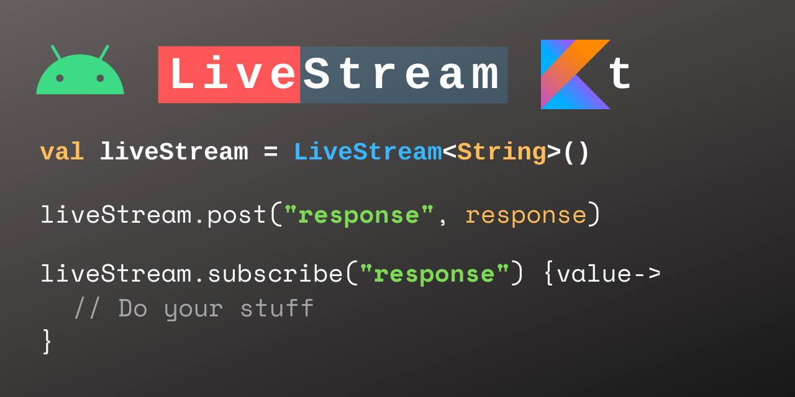
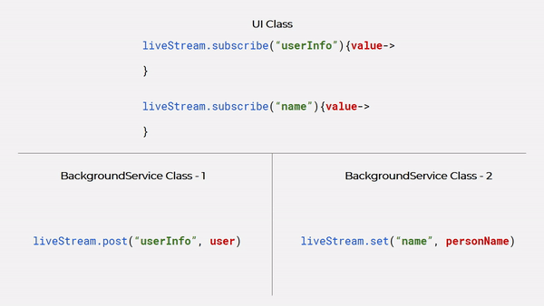

# LiveStream-Kt (Android) 📱

<p align="center">
  
</p>

LiveStream is a data holder class which can observe ***change*** of data in real-time and ***emit values*** too. Unlike other observables, LiveStream uses different approach. Here's emitter subscriber pattern. It's developed in Kotlin and fully compatible with Java.


[](https://patilshreyas.github.io/LiveStream-kt/docs/livestream-kt/)


## 💡 Introduction
`LiveStream` is different than any other data observables. As compared to Android Architecture Component's [`LiveData`](https://developer.android.com/reference/androidx/lifecycle/LiveData.html) it's totally different. In `LiveData`, you need to share the instance and then you need to add observer to listen for changes. It's useful in `ViewModel` to share data.
`LiveStream` is useful in background and UI data sharing. Here, you need to subscribe to data stream and just need to **emit data values** and **subscribe data stream** from anywhere in the application using multiple instances of `LiveStream`.

For e.g. 
You have following classes in app- 
- UI Class - `MainActivity`
- Service Class - `BackgroundService`

To share data in both classes, you will just need to add subscriber in UI class (MainActivity). In MainActivity, you'll subscribe to ***`httpResponse`*** stream.
In `BackgroundService` class, whenever you want to share data, you will just need to emit data on stream - ***`httpResponse`***.
Then, those who subscribed for `httpResponse` data stream will be dispatched on value emission.
<p align="center">
  
</p>


## ⚡️ Getting Started
This library is fully compatible with **Java**. Here we've demonstrated using Kotlin.

### Add Dependency
Add below dependency in [`build.gradle`](app/build.gradle) of your app module.

Latest Build - 
```gradle
dependencies {
    implementation 'dev.shreyaspatil:LiveStream-kt:0.2'
}
```

### Initialize `LiveStream` Class
`LiveStream` is a generic class. You can create instance as below.

```kotlin
        private val liveStream = LiveStream<String>()
```

### Subscribe to Stream / Add Observer
`LiveStream` event will be dispatched when data is changed. See below code to add observer / subscriber.

*Imagine, this code is in UI class of Android (e.g. MainActivity). Whenever value from background task (e.g. Service Class) is emitted, subscriber will listen live changes in data.*

```kotlin
        val observer = liveStream.subscribe("httpResponse") { response ->
            showToast("This is HTTP response: $response")
        }
```
`LiveStream#subscribe()` method will return instance of `StreamObserver`. This instance will be useful to unsubscribe from `LiveStream`.

### Emit Values/Data
You can emit values in `LiveData` from anywhere in the application. See below code.

#### From Main Thread :
To emit values from main thread, use `LiveStream#set()` method.
```kotlin
        val response = getResponse()
        liveStream.set("httpResponse", response)
```

#### From Other Thread :
To emit values from other thread, use `LiveStream#post()` method.
```kotlin
        val response = getResponse()
        liveStream.post("httpResponse", response)
```

### Unsubscribe 
To unsubscribe stream observer, use `LiveStream#unsubscribe()` method. It has to pass instance of `StreamObserver` which is obtained when you called `subscribe()` method. See below code.

```kotlin
    override fun onStop() {
        super.onStop()
        liveStream.unsubscribe(observer)
    }
```

## 🚀 Sample Usage
Sample code is available in [`/app`](/app) directory. Both Java & Kotlin code sample available.
- [Kotlin Sample](https://github.com/PatilShreyas/LiveStream-kt/tree/master/app/src/main/java/com/shreyaspatil/livestream/example/kotlin)
- [Java Sample](https://github.com/PatilShreyas/LiveStream-kt/tree/master/app/src/main/java/com/shreyaspatil/livestream/example/java)

## 🤝 Contribute
If you want to contribute to this library, you're always welcome!
See [Contributing Guidelines](CONTRIBUTING.md). 

## ✉️ Contact
If you need any help, you can connect with me.

Visit:- [shreyaspatil.dev](https://shreyaspatil.dev)

## 📃 License
```
MIT License

Copyright (c) 2020 Shreyas Patil

Permission is hereby granted, free of charge, to any person obtaining a copy
of this software and associated documentation files (the "Software"), to deal
in the Software without restriction, including without limitation the rights
to use, copy, modify, merge, publish, distribute, sublicense, and/or sell
copies of the Software, and to permit persons to whom the Software is
furnished to do so, subject to the following conditions:

The above copyright notice and this permission notice shall be included in all
copies or substantial portions of the Software.

THE SOFTWARE IS PROVIDED "AS IS", WITHOUT WARRANTY OF ANY KIND, EXPRESS OR
IMPLIED, INCLUDING BUT NOT LIMITED TO THE WARRANTIES OF MERCHANTABILITY,
FITNESS FOR A PARTICULAR PURPOSE AND NONINFRINGEMENT. IN NO EVENT SHALL THE
AUTHORS OR COPYRIGHT HOLDERS BE LIABLE FOR ANY CLAIM, DAMAGES OR OTHER
LIABILITY, WHETHER IN AN ACTION OF CONTRACT, TORT OR OTHERWISE, ARISING FROM,
OUT OF OR IN CONNECTION WITH THE SOFTWARE OR THE USE OR OTHER DEALINGS IN THE
SOFTWARE.
```
